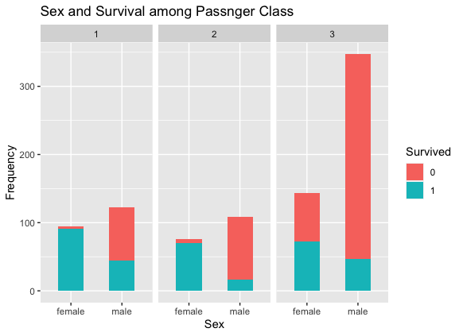

# Machine Learning Practice Project

The purpose of this project is to examine the predictive performance of different machine learning methods: linear discriminant analysis, logistic regression and random forest on which passenger survived the Titanic shipwreck. The data is obtained from Kaggle competition website [Kaggle _ data](https://www.kaggle.com/c/titanic/data)

The data is divided into two parts which are the training part that contains 891 observations "train.csv"" and testing part that contains 418 observations "test.csv". The training set will be used to train the statistical models, and the testing set will be used to assess the performance of the methods on predicting unseen data. To get the accuracy of the predictions, the predicted survival of the 418 passengers must be submitted on Kaggle which contains the true data.

The data contains 12 varaibles. The R code file "R_CODE.R" containes analysis and feature extraction from the 12 different variable whihc shows that some variables are predicitve and some are not. Figure 1 shows the titianic passnger survival in terms of sex and passnger class. From the figure, we can clearly see that survival rate for female is higher than male on all the three classes. Moreover, passnger on the first class have a higher survival rate from any other class. Thus, the variables sex and passnger class seems to have a prdictive peroframnce and will be included in the models. On the other hand, 

