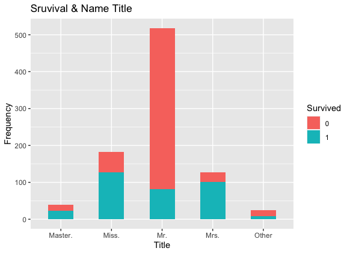

# Machine Learning Practice Project

The purpose of this project is to examine the predictive performance of different machine learning methods: linear discriminant analysis, logistic regression and random forest on which passenger survived the Titanic shipwreck. The data is obtained from Kaggle competition website and contain 12 variables [Kaggle _ data](https://www.kaggle.com/c/titanic/data)

The data is divided into two parts which are the training part that contains 891 observations "train.csv" and testing part that contains 418 observations "test.csv". The training set will be used to train the statistical models, and the testing set will be used to assess the performance of the methods on predicting unseen data. To get the accuracy of the predictions, the predicted survival of the 418 passengers must be submitted on Kaggle which contains the true data.

The data contains 12 varaibles. The R code file "R_CODE.R"" containes analysis  for the 12 different variable whihc shows that some variables are predicitve and some are not, but with feature extraxtion, some useful patterns would help in the predicting the survival. Figure 1 shows the titianic passnger survival in terms of sex and passnger class. From the figure, we can clearly see that survival rate for female is higher than male on all the three classes. Moreover, passnger on the first class have a higher survival rate from any other class. Thus, the variables sex and passnger class seem to have a predictive peroframnce and will be included in the models. 

On the other hand, the variable name on this data set is not predicitve as every passnger has a different name, but every name has title and by extracting the title, we discover that there is a pettern with survival as shown in figure 2 which shown that passnger with name title Miss, Mrs and Master survived more that passnger with a name title Mr. 

### Conclusion:
The random forest statistical method outperformed the linear discriminant analysis and the logistic regression methods in predicting the survival of the Titanic passenger as shown in the table below. The linear discriminant analysis performed better than the logistic regression in predicting the survival of the Titanic passenger. Cross vailation method implemtned on all of the predicitons to improve the accuracy of the models. Estimating the missing values for the variable age with median has a negative impact on the accuracy of all the models, so there is a room for improvement if the missing values of age are better estimated with other methods rather than the median.

| Model Type | Random Forest |  Logistic Regression | Linear Discriminant Analysis |
|-|-|-|-|
|Accuracy of Prediction|0.79904| 0.77511 |0.78468| 

